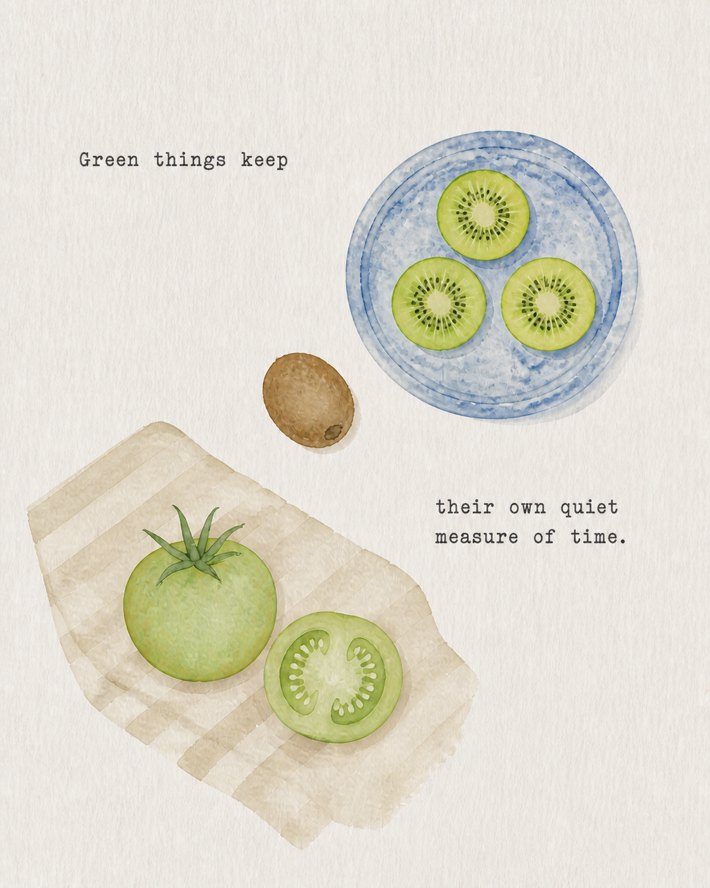
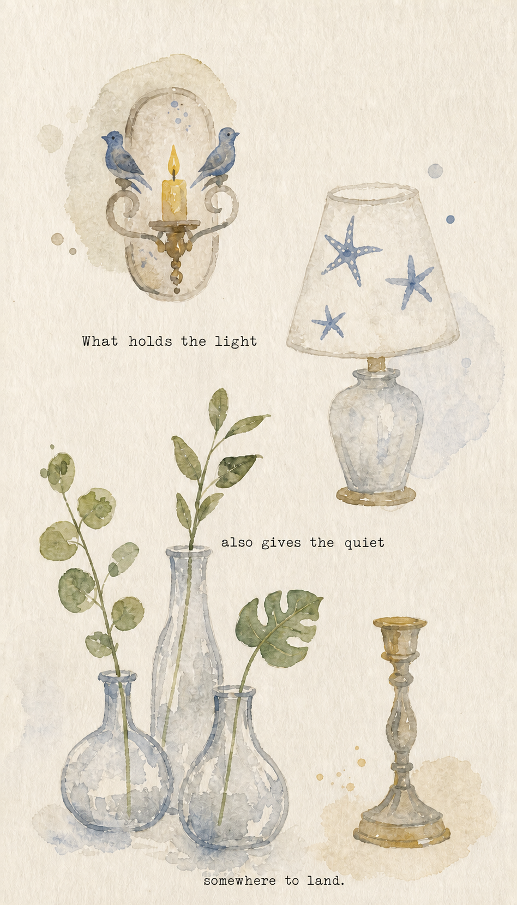
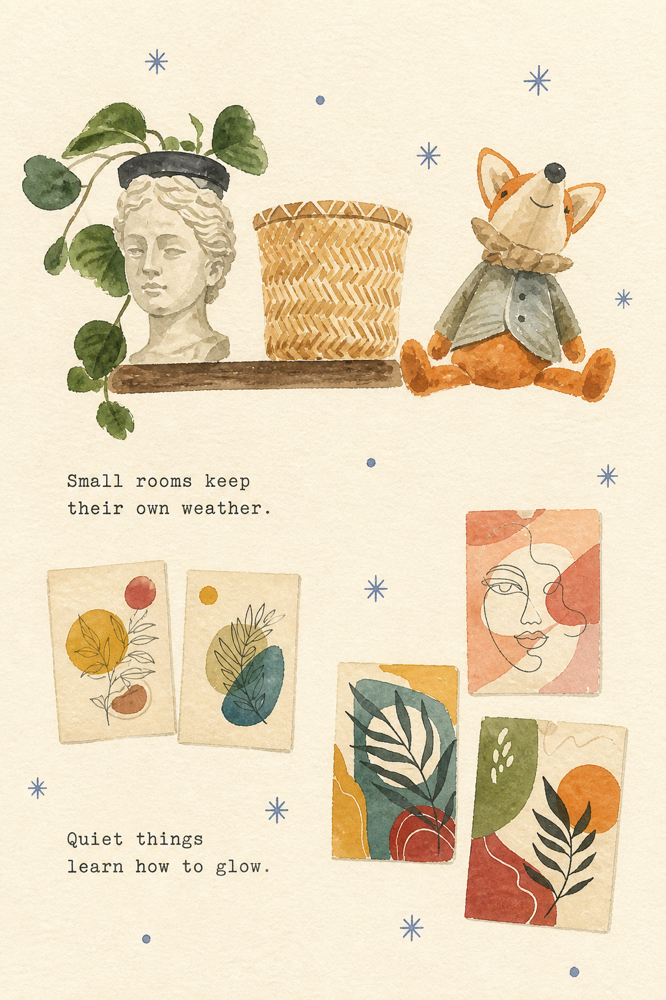
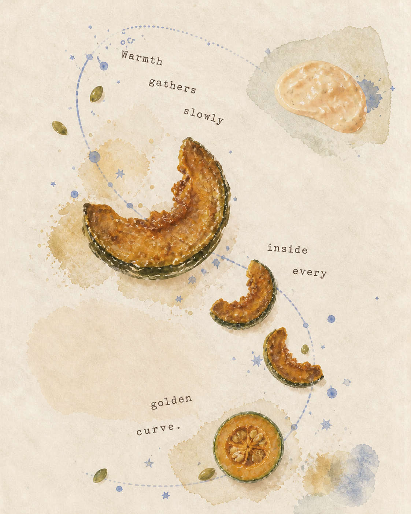
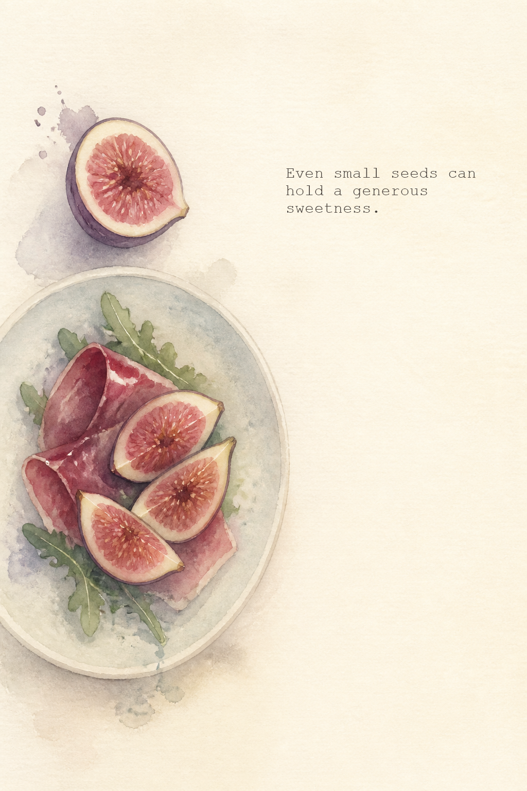
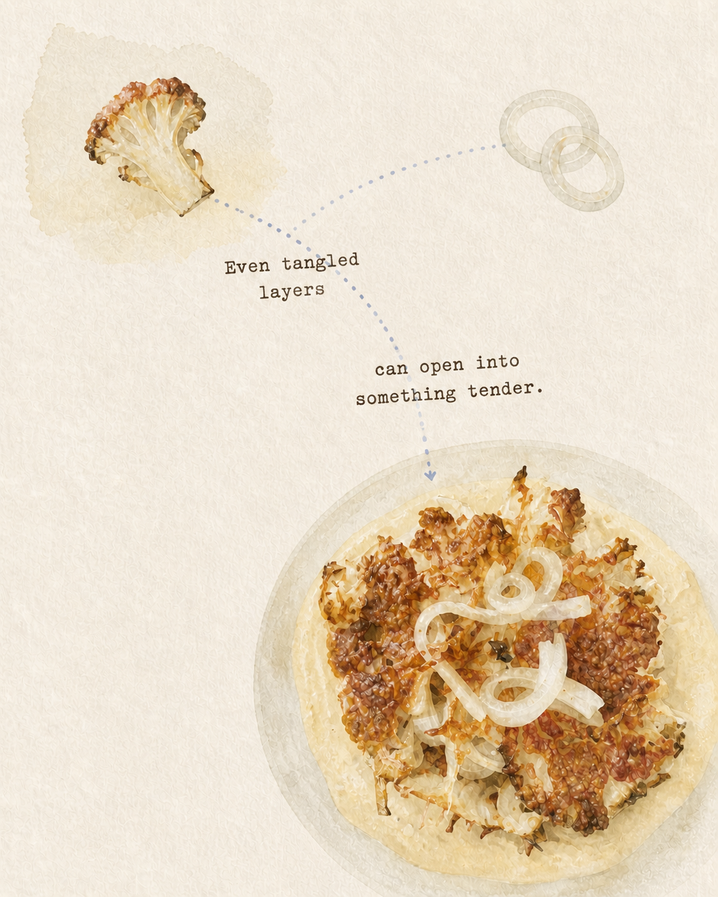
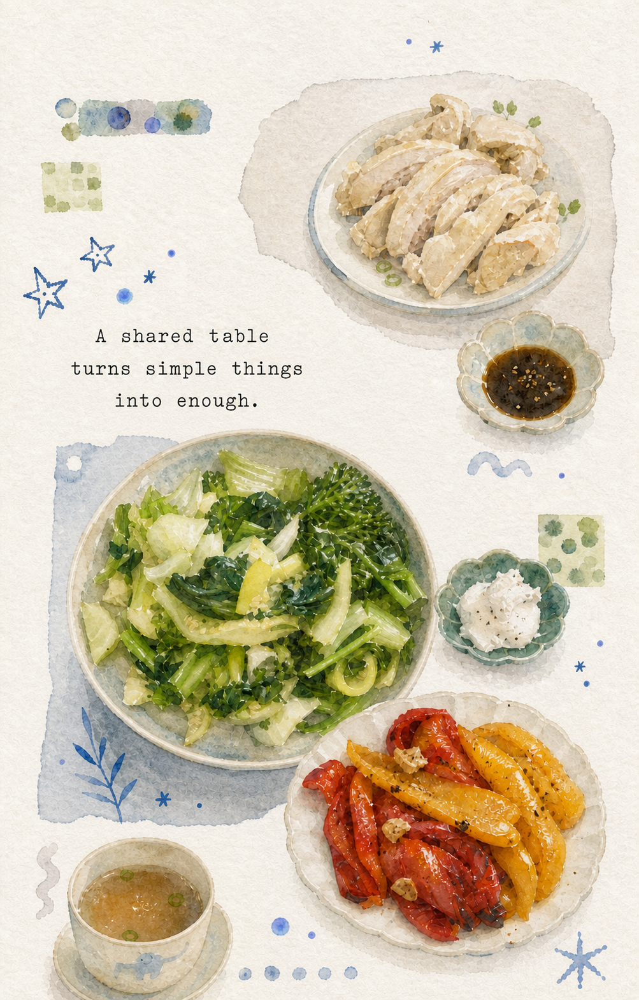
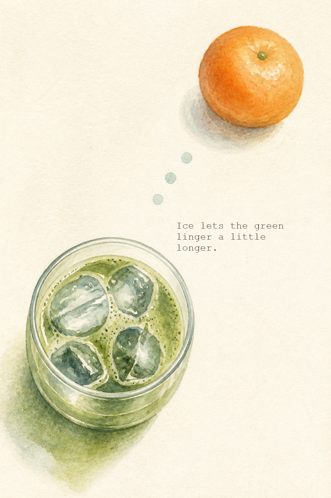

# Food Watercolor Study

Turn food and drink photos into recognisable poetic visual diaries: naive watercolor, handmade-paper collage, food-derived symbols, and a short English fortune woven into the page.

The skill keeps a dish's cooking state, key pairings, and serving relationship, while removing the original setting and simplifying incidental detail.

## Style catalogue

### Naive Watercolor Diary / 朴拙水彩手帐 — rendering character

This is the material and drawing character applied across every composition family. Subjects stay recognisable, but their circles, rims, perspective, proportions, and repeated motifs are gently inaccurate. Outlines appear only in fragments; diluted pigment fades into the paper, pools at occasional edges, blooms backward, and leaves small areas of paper white inside the object.

The style deliberately avoids the signals of computer illustration: perfect geometry, closed clean contours, identical repetitions, smooth gradients, pure saturated colors, glossy highlights, cast shadows, and fully modelled volume. Major colored forms contain visibly different pigment densities and occasional dry gaps. Supporting studies are flatter and more childlike than the focal subject.

### Poetic Collage / 诗意拼贴 — default mode

The core page structure is a **poetic watercolor scrapbook collage** rather than a photo filter or polished menu illustration. It pairs a clearly recognisable focal subject with small subject echoes and lets them form a visual association.

Its material language combines fibrous oatmeal paper, translucent granular pigment, blooms, deckled wash edges, dry-brush gaps, faint stains, irregular pale paper islands, and small vintage typewriter-style text. The page feels hand-painted, slightly awkward, quiet, and alive through natural visual rhythm: staggered placement, repeated colors/forms, partial overlap, and the direction of leaves, slices, or authentic drips. A visible line appears only when sauce, stem, steam, or another trace belongs naturally to the food; it is never drawn merely to force motion.

### Composition families

These are not separate art styles. They are different page structures inside the Poetic Collage language, so the results stay varied without losing their shared visual identity.

| Type | What it does | Best for |
| --- | --- | --- |
| **Orbit / 轨道** | Guides the eye around a drink or round food using curved lines, dots, seeds, or ice. | Iced drinks, citrus, round bowls, fruit. |
| **Falling Sequence / 坠落序列** | Arranges whole, cut, cooked, or melting states in a loose vertical or diagonal sequence. | Slices, pastries, roasted vegetables, fruit. |
| **Scrapbook Islands / 拼贴岛屿** | Places hero food and small studies on irregular translucent wash or torn-paper patches. | Shared meals, plated dishes, multi-part foods. |
| **Botanical Drift / 植物漂流** | Lets leaves, stems, real sauce, or steam create a natural diagonal relationship between separated elements. | Salads, herbs, fruit, tea, dishes with greens. |
| **Constellation / 食物星座** | Scatters food details, pigment dots, and restrained celestial marks across open paper. | Ingredients with small repeatable details: seeds, crumbs, berries, ice. |
| **Quiet Diagram / 安静图解** | Pairs one recognisable food with simple childlike studies of its layers, sections, or geometry. | Cauliflower, cakes, layered foods, drinks, cut fruit. |
| **Element Sampler / 元素拼画** | Separates a supplied prompt list into several balanced mini-scenes with text in the gaps. | Mixed food, drink, and object prompts without a source photo. |

## What every image keeps

- A simplified but immediately recognisable prepared dish or drink.
- One to three selected food-derived echoes, never a complete ingredient inventory.
- A limited palette: dominant food color, faded cobalt or periwinkle accent, and warm paper neutral.
- Strong scale contrast, asymmetry, and generous open paper.
- An airy but inhabited page: one hero, a small edited group of food studies and quiet marks, and plenty of breathing room.
- A calm original English fortune, added in a second pass and arranged as part of the visual path.
- Gently distorted geometry, broken outlines, paper gaps, pigment blooms, and almost no cast shadow.

## Still-life style tests

Although the skill remains food-first, a user may supply 3–5 household or botanical objects to test the same visual language. The skill keeps each named object family and its defining motif, distributes them as separate diary studies, and derives the fortune from shared ideas such as light, glass, shelter, flame, or growth.

### Watercolor Symbol Diary / 水彩符号手帐 — still-life mode

Still-life pages behave like a collection of small hand-painted signs rather than a conventional still-life painting. Four to six object clusters float at related scales, with no mandatory hero, tabletop, horizon, or cast shadow. Each object keeps only its recognition-bearing detail: a lamp may be a pale base and an uneven patterned shade; a candle may be a simple holder and yellow teardrop flame; transparent bottles may be nothing more than broken gray-blue contours, a short waterline, and plant stems.

Plants are reduced to thin irregular stems and a few flat translucent leaves or flowers. Six to fourteen handmade faded-cobalt stars, asterisks, dots, or dashes occupy the gaps between clusters. They provide visual pauses and page rhythm, but they never become a connecting line. A multi-cluster still-life may use one or two brief fortunes; food pages continue to use one food-linked fortune and fewer decorative marks.

### Element Sampler / 元素拼画 — prompt-list mode

For a short prompt list rather than a food photograph—such as “watermelon, tomato, shaved ice, wind chime”—the page becomes four to six separate mini-scenes. Each supplied item has its own small observation, and one food may repeat as a simple variation: for example, a plate of watermelon wedges and one loose wedge. The clusters stay loosely balanced rather than centering a giant hero, and roughly half the page remains quiet paper.

This mode does not automatically add stars, orbit lines, splatters, or arbitrary plants. Small pattern marks must belong to an actual named object. Two short original fortunes can sit in the empty gaps between vignettes, producing the gentle illustrated-page rhythm of a handmade visual diary.

## Use

Upload a food or drink photo—or provide a compact still-life or mixed-element list—and ask Codex to use `$food-watercolor-study`. The skill selects the most suitable composition family, creates the text-free naive-watercolor collage, then adds a precise, readable subject-linked fortune.

## Updated examples

### Green tomato and kiwi — Element Sampler

### Candle, birds, lamp, and glass vessels — Watercolor Symbol Diary

### Shelf objects and abstract wall art — Watercolor Symbol Diary

### Roasted squash with herb dip — Orbit + Falling Sequence

### Fig and prosciutto salad — Botanical Drift

### Roasted cauliflower with onion ribbons — Quiet Diagram + Constellation

### Home-style chicken and vegetables — Scrapbook Islands

### Iced matcha and mandarin — Orbit + Constellation

